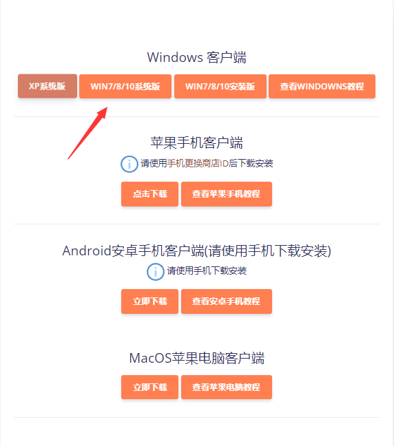

# Windows系统


**保持智商！为了保证您的隐私安全以及网络隐蔽性建议进行下列操作：**

**1.请卸载360及各类毒霸以及所有的国产杀毒软件，**[**如何卸载？点这里**](https://jingyan.baidu.com/article/4d58d5411fe5d99dd4e9c09b.html)\*\*\*\*

**2.请卸载各类360安全浏览器以及所有国产浏览器**

**3.请安装**[**火绒杀毒**](https://www.huorong.cn/)**保障您的电脑安全，而不是使用以上的软件监控你的电脑**

**4.请安装**[**谷歌浏览器**](https://www.google.com/intl/zh-CN/chrome/)**或**[**火狐浏览器**](http://www.firefox.com.cn/)**保障您的上网安全，而不是使用国产浏览器来泄露您的网络隐私**

**如果您坚持不卸载以上的各种软件，那么我建议您不要使用我们的服务，因为您的智商可能过低，可能易被某些国外团体洗脑易造成您的身心不适~**


## [下载客户端并安装（Windows 7 & Windows 10）](https://jichang.cn-bj.ufileos.com/app/nie.exe)

## 解压后打开ShadowsocksR.exe

1. 右下角任务栏找到红色小飞机，点击右键
2. 找到服务器订阅-选择SSR服务器订阅设置
3. 点击Add----在网址栏（全选后）把订阅地址粘贴进去

### 右下角任务栏找到红色小飞机，点击右键，服务器--Nie萌----选择一条你想用的节点，点击左键选中。

### 任务栏右键--找到系统代理模式---选择PAC模式（左键点击）即可正常访问外网。如果打不开外网，请尝试更换另外一个节点或者换（全局模式）

## 成功访问youtube!

### 

### 

## **如果更新訂閱失敗**

如果更新订阅失败，可以使用浏览器打开订阅网址，根据返回的信息来判断更新失败的原因。

如果无法打开订阅网址

说明当前网络无法访问订阅网址。

* 1、尝试退出代理或断开VPN后重新打开订阅网址。
* 2、尝试在不同的网络下「4G、WIFI或连接其它网络」打开订阅网址。
* 3、确保防火墙没有阻止shadowsocksr.exe
* 4、确认购买的套餐的节点类型是否是SSR。如果不是请使用v2online客户端。

如果显示c3NyOi8v开头的一行乱码

说明可以正常访问订阅网址。说明网络波动，多尝试几次即可。

如果显示Product not Active！

说明订阅网址对应的套餐过期未缴费。续费即可。

如果显示Authentication failed

说明订阅网址不存在。前往用户中心复制订阅网址以确保订阅网址无误，然后两次尝试，如果问题依旧，请找到套餐详情页中点击重置订阅按钮重置订阅网址。

如果显示Critical Error Could not connect to the database

说明我们的订阅服务器正在维护。什么都不用做，等待修复即可。

